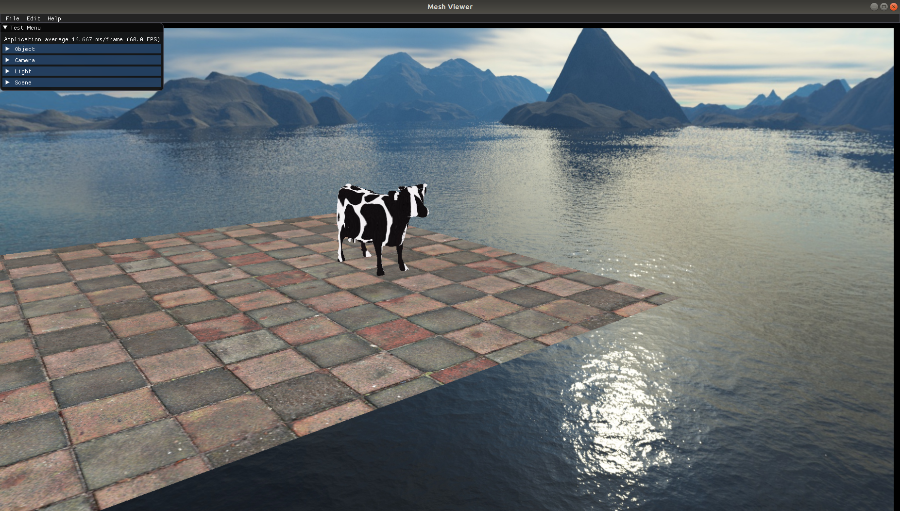

# Computer Graphics Project

## Notes
1. Final project in the course "Computer Graphics, 203.3710, Haifa University, Israel"
2. The program allows the user to create a scene with many objects/light sources and cameras. Also, includes some cool features such as shades, fog, environemnt, reflection, bloom and many more

## Technology & Tools
1. Written in C++, using OpenGL library
2. Uses OpenGL addional librararies such as: glfw, glad and glm
3. Uses 3'th part libraries such as ImGui

## Build & Run (Cmake files compatible for Linix only)
1. Clone repository 
2. cd repository-dir 
3. cmake -S . -B ./build 
4. cd build 
5. make 
6. cd bin 
7. ./MeshViewer 

## Scenes

